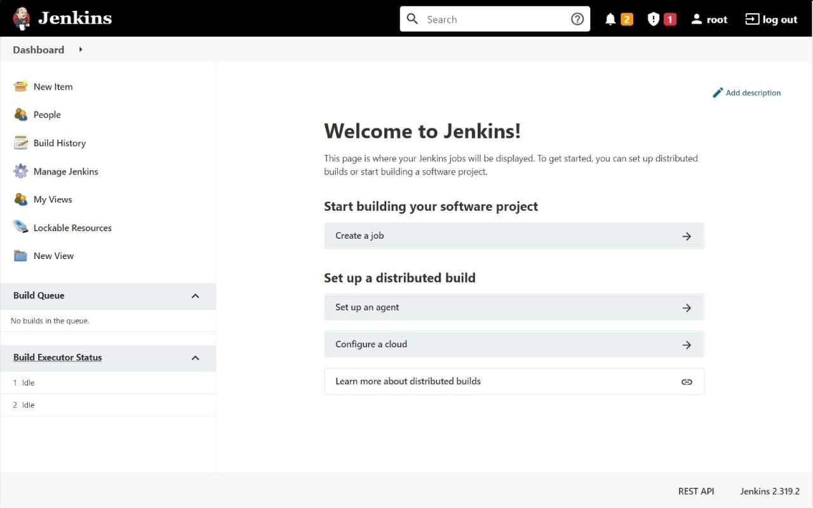

# Jenkins Agent CI/CD pipeline

Deploy Jenkins Agent with CI/CD on Elestio

 
 

# When deploying ...

Set the SSH public key that should be accepted by your agent (usually the Public SSH Key of your Jenkins server) you can set it in this env var
    
    JENKINS_AGENT_SSH_PUBKEY

Note 1: You can also edit the Dockerfile if you want to include any specific tool in the jenkins-agent container, by default we have git, docker.io, curl & rsync preinstalled but you can add anything you need in Dockerfile.

# Once deployed ...

Agent will be available on:

    Host: [CI_CD_DOMAIN]
    Protocol: SSH
    Port: 2222
    SSH User: jenkins
    Auth: (based on the SSH Public Key provided in env var)

## How to add the agent node to your Jenkins server

1) Go to your Jenkins server and install the plugin `ssh-slaves` (https://YOUR_JENKINS_SERVER/manage/pluginManager/available)
2) In your Jenkins server add a new node (https://YOUR_JENKINS_SERVER/computer/new)
3) Fill the Node/agent name and select the type; (e.g. Name: agent1, Type: Permanent Agent)

Now fill the fields:

    Remote root directory; (e.g.: /home/jenkins )
    label; (e.g.: agent1 )
    usage; (e.g.: only build jobs with label expression…​)
    Launch method; (e.g.: Launch agents by SSH )
    Host; (e.g.: localhost or your IP address )
    Credentials; (e.g.: jenkins )
    Host Key verification Strategy; (e.g.: Manually trusted key verification …​ )

4) Press the Save button and the agent1 will be registered, but offline for the time being. Click on it.
5) You should now see This node is being launched.. If that’s not the case, you can now press the Relaunch agent button and wait a few seconds. You can now click on the Log button on the left, then you should receive the message: Agent successfully connected and online on the last log line.
